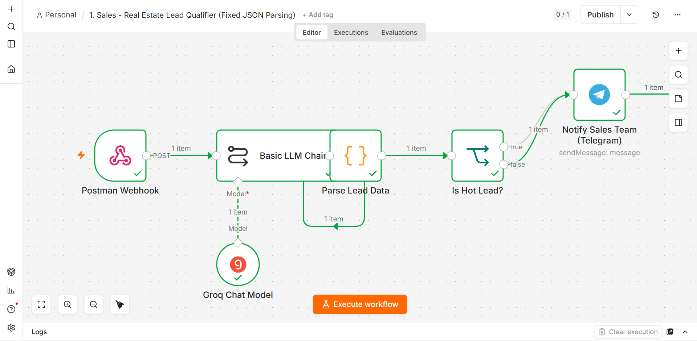

# Real Estate Lead Qualifier (n8n Workflow)

An n8n automation that receives incoming real estate leads via a webhook, uses an LLM to qualify them as **Hot** or **Cold**, and instantly notifies the sales team on Telegram when a hot lead comes in.

## How It Works

1. **Webhook Trigger** — Receives a POST request containing an incoming lead message (e.g. forwarded from a chat platform).
2. **LLM Chain** — Passes the lead's message to an LLM (via Groq, using `openai/gpt-oss-20b`) to analyze intent, budget, and location, and classify the lead.
3. **JSON Parser (Code Node)** — Robustly extracts the JSON object from the LLM's raw text response. If parsing fails or no JSON is found, it falls back to a safe default (`status: "Cold"`) instead of breaking the workflow.
4. **Lead Routing (IF Node)** — Checks whether the lead's status is `"Hot"`.
5. **Telegram Notification** — Sends a formatted alert to the sales team's Telegram chat with the lead's budget, location, and evaluation notes.

## Workflow Diagram

## Nodes Used

| Node | Type | Purpose |
|---|---|---|
| Postman Webhook | `n8n-nodes-base.webhook` | Entry point for incoming lead data |
| Basic LLM Chain | `@n8n/n8n-nodes-langchain.chainLlm` | Sends the lead message to the LLM |
| Groq Chat Model | `@n8n/n8n-nodes-langchain.lmChatGroq` | LLM provider powering the qualification logic |
| Parse Lead Data | `n8n-nodes-base.code` | Extracts and safely parses the LLM's JSON output |
| Is Hot Lead? | `n8n-nodes-base.if` | Routes leads based on qualification status |
| Notify Sales Team (Telegram) | `n8n-nodes-base.telegram` | Alerts the sales team about hot leads |

## Setup

1. Import `lead-qualifier-workflow.json` into your n8n instance.
2. Add your own **Groq API** credentials and select them in the *Groq Chat Model* node.
3. Add your own **Telegram Bot API** credentials and select them in the *Notify Sales Team* node.
4. Replace `YOUR_TELEGRAM_CHAT_ID` in the Telegram node with your sales team's chat ID.
5. Activate the workflow and point your lead source (e.g. a bot or CRM webhook) to the generated webhook URL.

## Notes

- All credential IDs, chat IDs, and instance identifiers have been removed/replaced with placeholders in the exported workflow file for safe public sharing.
- The JSON-parsing step was specifically hardened to handle cases where the LLM doesn't return perfectly clean JSON, ensuring the workflow never crashes on malformed model output.
